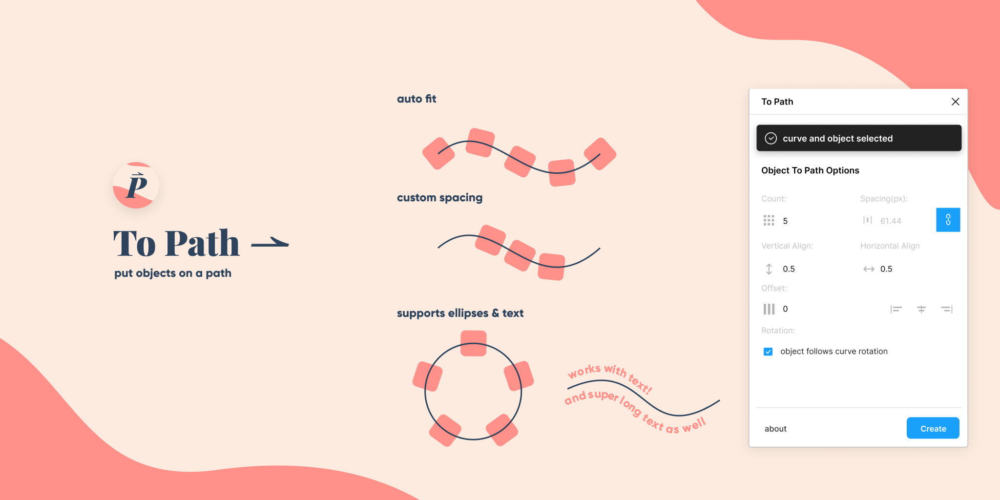

## In Progress: V 2.0

- [x] switch to new stack (svelte, rollup, pnpm)
- [x] rewrite core bezier algorithm
- [x] rethink "preview" functionality
- [x] refactor "place objects" code
- [x] rewrite text to path function
- [x] redesign UI (partially done)
- [ ] implement new ui
- [ ] test and review

# To-Path: A Figma Plugin

✨ 𝙋𝙪𝙩 𝙖𝙣𝙮 𝙤𝙗𝙟𝙚𝙘𝙩𝙨 𝙤𝙧 𝙩𝙚𝙭𝙩 𝙤𝙣 𝙖 𝙥𝙖𝙩𝙝!✨

1. select a curve
2. select an object, group, or text
3. hit "link" and watch the magic\* happen

\*Its janky code and its not actually magic

╭┈─────── ೄྀ࿐ ˊˎ-

╰┈➤ 𝙄𝙈𝙋𝙊𝙍𝙏𝘼𝙉𝙏

Version 1.5.0 and higher's revamped live updates WILL NOT
work on previous linked paths made by this plugin!
You must create a new linked path group!

☆ ゜・。。・゜゜・。。・゜ ★

🌙 𝙄𝙨𝙨𝙪𝙚𝙨 𝙤𝙧 𝙁𝙚𝙖𝙩𝙪𝙧𝙚 𝙍𝙚𝙦𝙪𝙚𝙨𝙩𝙨🌙

Open an issue on the github:

https://github.com/codelastnight/to-path-figma

☆ ゜・。。・゜゜・。。・゜ ★

❤️ 𝙇𝙞𝙠𝙚 𝙬𝙝𝙖𝙩 𝙄 𝙙𝙤? ❤️

consider buying me a coffee :)

https://ko-fi.com/lastnight

─────────✧❁✧─────────

˚ 　　　　　 　 ⊹ 　 　 　　　 　 ·　 _ 　　 ✧ 　　　 ⋆ 　　 · _ . · . 　 　 · ·　 　　　　　.. 　 . . 　 　　　 · + 　　　 　 ·　 _ ✫ 　　 _ ⊹ _ ˚ 　　　 　. . 　　　 　　· 　 ⋆ 　　　　　　 _ 　　 　 　 . 　　 　　 　　 * . 　 　 . ·　 . 　 · 　　　 . 　 　 　 　 　 *　 · 　　　 　 . · 　 · + 　. 　 　　　　 · \*_ ˚ 　　　 　. . + 　　　 　　· 　 ⋆ 　　　　　　 _ 　　 　 　 . 　　 　　 　　 _ . 　 　 . ·　 . 　 · 　　　 . 　 　 　 　 　 _

## How it Works

1. the plugin generates an array of points (420 between each point but you can also change this in the "about" menu) using castejau's algorithm that follows the curve, also finding the angle of the tangent of each point. the length from the start of the curve to each point is also generated and stored (find out more here: https://javascript.info/bezier-curve)

2. the nth's object's x position + object width + spacing is calculated
3. the plugin compares the x position of the object with the array of points. 2 points with closest length is picked
4. then the plugin finds the point between those two points and finds the exact point to place the object. the angle used is just the tangent of the nearest point.
5. the object is placed and the plugin moves onto the next object.

## development setup

1.  install packages:
    `npm i`

2.  compile :
    `npm run prod`

mfw someone else already put out something similar to my plugin but i spent too much time on this to stop now.
